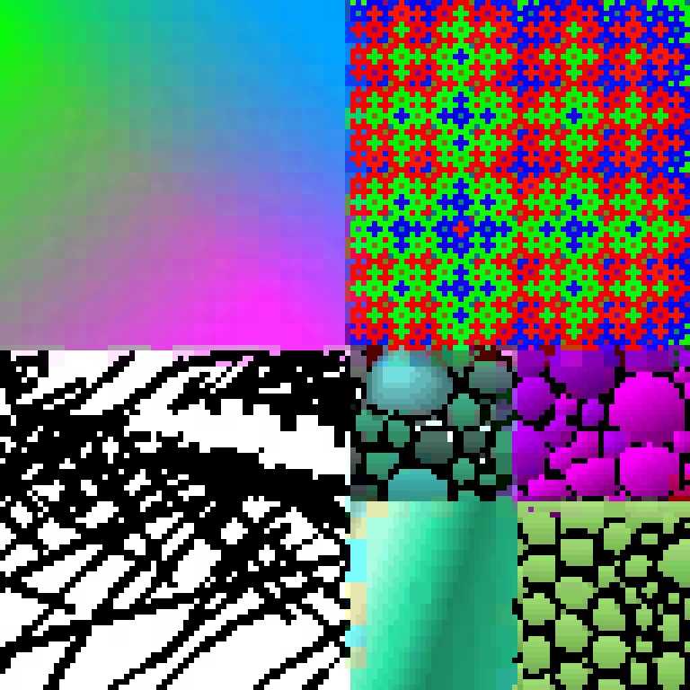

# astcenc_slang
ASTC Encoder in Slang

Now converges in ~20-40 steps for 2-partition

Caveat for 3-partition and above. The current approach is a coordinate descent to:

1. Use gradient descent on the color eps (this can be replaced by an exact PCA or lsq solver)
2. Choose the optimal partition based on distance to each color line
3. Project the ground truth pixels onto the color line to solve for the weights
4. For the last N steps, snap the ideal partition onto the set of valid ASTC partition patterns (1024)

For 2-partition, this final step works great because your hamming error rate for pixel partition mismatch is like 0.6 - 1.2 pixels per 16 pixels.

~However, this jumps to like 11-12 pixels per 16 pixels for the 3-partition problem, because the valid partition space became so much smaller than the full set of valid patterns (2^10 out of 2^16 vs 2^25.5). As a result, this technique just collapses down to doing single partition search once you perform the snap.~

~It seems like the only way forward is to do (hard) bruteforce combinatorial search of each of the ~300 unique valid partition patterns. This will be ~50x more expensive than the current approach, going from something like 20 megapixels/s down to just 0.5 megapixels/s.~

## cat.jpg

**Original**:


**Single Partition**:


```
--- Starting 1-Partition Compression ---
Running gradient descent for 40 steps

Optimization finished in 48.46 ms over 129600 threads
  Wall clock: 0.6455645561218262
Step 0: loss = 0.7794 (0.03 ms/thread mean, 0.02 ms / 0.12 ms)
Step 2: loss = 0.1151 (0.06 ms/thread mean, 0.05 ms / 0.26 ms)
Step 4: loss = 0.0373 (0.10 ms/thread mean, 0.08 ms / 0.40 ms)
Step 6: loss = 0.0201 (0.13 ms/thread mean, 0.11 ms / 0.54 ms)
Step 8: loss = 0.0152 (0.16 ms/thread mean, 0.14 ms / 0.68 ms)
Step 10: loss = 0.0133 (0.20 ms/thread mean, 0.17 ms / 0.82 ms)
Step 12: loss = 0.0123 (0.23 ms/thread mean, 0.20 ms / 0.88 ms)
Step 14: loss = 0.0117 (0.26 ms/thread mean, 0.23 ms / 0.91 ms)
Step 16: loss = 0.0112 (0.29 ms/thread mean, 0.26 ms / 0.94 ms)
Step 18: loss = 0.0109 (0.33 ms/thread mean, 0.29 ms / 0.97 ms)
Step 20: loss = 0.0106 (0.36 ms/thread mean, 0.32 ms / 1.00 ms)
Step 22: loss = 0.0104 (0.39 ms/thread mean, 0.35 ms / 1.03 ms)
Step 24: loss = 0.0102 (0.42 ms/thread mean, 0.38 ms / 1.07 ms)
Step 26: loss = 0.0100 (0.45 ms/thread mean, 0.41 ms / 1.13 ms)
Step 28: loss = 0.0098 (0.48 ms/thread mean, 0.44 ms / 1.17 ms)
Step 30: loss = 0.0097 (0.52 ms/thread mean, 0.47 ms / 1.20 ms)
Step 32: loss = 0.0096 (0.55 ms/thread mean, 0.50 ms / 1.23 ms)
Step 34: loss = 0.0095 (0.58 ms/thread mean, 0.53 ms / 1.26 ms)
Step 36: loss = 0.0093 (0.61 ms/thread mean, 0.56 ms / 1.29 ms)
Step 38: loss = 0.0092 (0.64 ms/thread mean, 0.59 ms / 1.32 ms)
 + diagnostics overhead per thread: 0.00735 ms / 0.00236 ms / 0.02276 ms
Final Mean L^2 Loss per block: 0.0092
Saved reconstructed image to 'reconstructed_1p.png'
```

**Dual Partition**:


~2x time, 4x better quality (need to include 2p LUT as well)

```
--- Starting 2-Partition Compression ---
Running gradient descent for 40 steps

Optimization finished in 74.33 ms over 129600 threads
  Wall clock: 0.8531746864318848
Step 0: loss = 0.0417 (0.05 ms/thread mean, 0.03 ms / 0.23 ms)
  Partition hamming error at step 0: 143545
  Mask: 01010000000000010001010101010101
  Histogram of partitions used: [8674, 120926, 0, 0]
Step 2: loss = 0.0071 (0.10 ms/thread mean, 0.08 ms / 0.46 ms)
  Partition hamming error at step 1: 141273
  Mask: 01010000000000010001010101010101
  Histogram of partitions used: [7559, 122041, 0, 0]
Step 4: loss = 0.0038 (0.15 ms/thread mean, 0.12 ms / 0.66 ms)
  Partition hamming error at step 2: 139092
  Mask: 01010000000000010001010101010101
  Histogram of partitions used: [7467, 122133, 0, 0]
Step 6: loss = 0.0027 (0.20 ms/thread mean, 0.17 ms / 0.74 ms)
  Partition hamming error at step 3: 138439
  Mask: 01010000000000010001010101010101
  Histogram of partitions used: [7428, 122172, 0, 0]
Step 8: loss = 0.0022 (0.25 ms/thread mean, 0.21 ms / 0.80 ms)
  Partition hamming error at step 4: 138153
  Mask: 01010000000000010001010101010101
  Histogram of partitions used: [7416, 122184, 0, 0]
Step 10: loss = 0.0020 (0.29 ms/thread mean, 0.26 ms / 0.85 ms)
  Partition hamming error at step 5: 137933
  Mask: 01010000000000010001010101010101
  Histogram of partitions used: [7408, 122192, 0, 0]
Step 12: loss = 0.0019 (0.34 ms/thread mean, 0.30 ms / 0.91 ms)
  Partition hamming error at step 6: 137769
  Mask: 01010000000000010001010101010101
  Histogram of partitions used: [7400, 122200, 0, 0]
Step 14: loss = 0.0018 (0.39 ms/thread mean, 0.35 ms / 0.96 ms)
  Partition hamming error at step 7: 137733
  Mask: 01010000000000010001010101010101
  Histogram of partitions used: [7394, 122206, 0, 0]
Step 16: loss = 0.0018 (0.43 ms/thread mean, 0.39 ms / 1.01 ms)
  Partition hamming error at step 8: 137696
  Mask: 01010000000000010001010101010101
  Histogram of partitions used: [7386, 122214, 0, 0]
Step 18: loss = 0.0018 (0.48 ms/thread mean, 0.44 ms / 1.06 ms)
  Partition hamming error at step 9: 137698
  Mask: 01010000000000010001010101010101
  Histogram of partitions used: [7365, 122235, 0, 0]
Step 20: loss = 0.0017 (0.53 ms/thread mean, 0.48 ms / 1.11 ms)
  Partition hamming error at step 10: 137717
  Mask: 01010000000000010001010101010101
  Histogram of partitions used: [7353, 122247, 0, 0]
Step 22: loss = 0.0017 (0.57 ms/thread mean, 0.53 ms / 1.16 ms)
  Partition hamming error at step 11: 137732
  Mask: 01010000000000010001010101010101
  Histogram of partitions used: [7339, 122261, 0, 0]
Step 24: loss = 0.0017 (0.62 ms/thread mean, 0.57 ms / 1.21 ms)
  Partition hamming error at step 12: 137752
  Mask: 01010000000000010001010101010101
  Histogram of partitions used: [7335, 122265, 0, 0]
Step 26: loss = 0.0017 (0.67 ms/thread mean, 0.61 ms / 1.26 ms)
  Partition hamming error at step 13: 137747
  Mask: 01010000000000010001010101010101
  Histogram of partitions used: [7322, 122278, 0, 0]
Step 28: loss = 0.0017 (0.71 ms/thread mean, 0.66 ms / 1.31 ms)
  Partition hamming error at step 14: 137752
  Mask: 01010000000000010001010101010101
  Histogram of partitions used: [7323, 122277, 0, 0]
Step 30: loss = 0.0017 (0.76 ms/thread mean, 0.70 ms / 1.36 ms)
  Partition hamming error at step 15: 137795
  Mask: 01010000000000010001010101010101
  Histogram of partitions used: [7319, 122281, 0, 0]
Step 32: loss = 0.0038 (0.81 ms/thread mean, 0.75 ms / 1.42 ms)
  Partition hamming error at step 16: 0
  Mask: 00000101010101000100000000000001
  Histogram of partitions used: [0, 129600, 0, 0]
Step 34: loss = 0.0029 (0.86 ms/thread mean, 0.79 ms / 1.47 ms)
  Partition hamming error at step 17: 0
  Mask: 00000101010101000100000000000001
  Histogram of partitions used: [0, 129600, 0, 0]
Step 36: loss = 0.0025 (0.92 ms/thread mean, 0.84 ms / 1.53 ms)
  Partition hamming error at step 18: 0
  Mask: 00000101010101000100000000000001
  Histogram of partitions used: [0, 129600, 0, 0]
Step 38: loss = 0.0023 (0.97 ms/thread mean, 0.89 ms / 1.58 ms)
  Partition hamming error at step 19: 0
  Mask: 00000101010101000100000000000001
  Histogram of partitions used: [0, 129600, 0, 0]
 + diagnostics overhead per thread: 0.01648 ms / 0.00464 ms / 0.08748 ms
Partition hamming error: 0.8498765432098765
Final Mean L^2 Loss per block: 0.0023
```

**3 Partitions**:


~ similar time and final quality as 2p

```
--- Starting 3-Partition Compression ---
Running gradient descent for 40 steps

Optimization finished in 79.16 ms over 129600 threads
  Wall clock: 0.8477416038513184
Step 0: loss = 0.0327 (0.06 ms/thread mean, 0.04 ms / 0.24 ms)
  Partition hamming error at step 0: 298856
  Mask: 10100000000000100010101010100101
  Histogram of partitions used: [3544, 24541, 101515, 0]
Step 2: loss = 0.0067 (0.11 ms/thread mean, 0.08 ms / 0.47 ms)
  Partition hamming error at step 1: 307530
  Mask: 10100000000000100010101010100101
  Histogram of partitions used: [3416, 21285, 104899, 0]
Step 4: loss = 0.0033 (0.17 ms/thread mean, 0.13 ms / 0.67 ms)
  Partition hamming error at step 2: 307347
  Mask: 10100000000000100010101010100101
  Histogram of partitions used: [3409, 20998, 105193, 0]
Step 6: loss = 0.0020 (0.22 ms/thread mean, 0.17 ms / 0.76 ms)
  Partition hamming error at step 3: 307424
  Mask: 10100000000000100010101010100101
  Histogram of partitions used: [3407, 20871, 105322, 0]
Step 8: loss = 0.0015 (0.27 ms/thread mean, 0.21 ms / 0.82 ms)
  Partition hamming error at step 4: 307584
  Mask: 10100000000000100010101010100101
  Histogram of partitions used: [3404, 20816, 105380, 0]
Step 10: loss = 0.0012 (0.32 ms/thread mean, 0.25 ms / 0.87 ms)
  Partition hamming error at step 5: 307645
  Mask: 10100000000000100010101010100101
  Histogram of partitions used: [3404, 20791, 105405, 0]
Step 12: loss = 0.0011 (0.37 ms/thread mean, 0.30 ms / 0.93 ms)
  Partition hamming error at step 6: 307890
  Mask: 10100000000000100010101010100101
  Histogram of partitions used: [3404, 20761, 105435, 0]
Step 14: loss = 0.0010 (0.41 ms/thread mean, 0.34 ms / 0.98 ms)
  Partition hamming error at step 7: 308061
  Mask: 10100000000000100010101010100101
  Histogram of partitions used: [3404, 20760, 105436, 0]
Step 16: loss = 0.0010 (0.46 ms/thread mean, 0.38 ms / 1.04 ms)
  Partition hamming error at step 8: 308185
  Mask: 10100000000000100010101010100101
  Histogram of partitions used: [3402, 20761, 105437, 0]
Step 18: loss = 0.0010 (0.51 ms/thread mean, 0.42 ms / 1.09 ms)
  Partition hamming error at step 9: 308200
  Mask: 10100000000000100010101010100101
  Histogram of partitions used: [3402, 20762, 105436, 0]
Step 20: loss = 0.0009 (0.56 ms/thread mean, 0.47 ms / 1.14 ms)
  Partition hamming error at step 10: 308279
  Mask: 10100000000000100010101010100101
  Histogram of partitions used: [3402, 20759, 105439, 0]
Step 22: loss = 0.0009 (0.61 ms/thread mean, 0.51 ms / 1.19 ms)
  Partition hamming error at step 11: 308384
  Mask: 10100000000000100010101010100101
  Histogram of partitions used: [3402, 20757, 105441, 0]
Step 24: loss = 0.0009 (0.66 ms/thread mean, 0.55 ms / 1.24 ms)
  Partition hamming error at step 12: 308464
  Mask: 10100000000000100010101010100101
  Histogram of partitions used: [3401, 20762, 105437, 0]
Step 26: loss = 0.0009 (0.71 ms/thread mean, 0.60 ms / 1.29 ms)
  Partition hamming error at step 13: 308547
  Mask: 10100000000000100010101010100101
  Histogram of partitions used: [3399, 20766, 105435, 0]
Step 28: loss = 0.0009 (0.75 ms/thread mean, 0.64 ms / 1.34 ms)
  Partition hamming error at step 14: 308621
  Mask: 10100000000000100010101010100101
  Histogram of partitions used: [3397, 20777, 105426, 0]
Step 30: loss = 0.0009 (0.80 ms/thread mean, 0.68 ms / 1.40 ms)
  Partition hamming error at step 15: 308716
  Mask: 10100000000000100010101010100101
  Histogram of partitions used: [3395, 20783, 105422, 0]
Step 32: loss = 0.0064 (0.86 ms/thread mean, 0.73 ms / 1.45 ms)
  Partition hamming error at step 16: 0
  Mask: 10100101010101100110101010101010
  Histogram of partitions used: [0, 44146, 85454, 0]
Step 34: loss = 0.0039 (0.91 ms/thread mean, 0.78 ms / 1.51 ms)
  Partition hamming error at step 17: 0
  Mask: 10100101010101100110101010101010
  Histogram of partitions used: [0, 45876, 83724, 0]
Step 36: loss = 0.0030 (0.97 ms/thread mean, 0.83 ms / 1.58 ms)
  Partition hamming error at step 18: 0
  Mask: 10100101010101100110101010101010
  Histogram of partitions used: [0, 46528, 83072, 0]
Step 38: loss = 0.0024 (1.03 ms/thread mean, 0.88 ms / 1.64 ms)
  Partition hamming error at step 19: 0
  Mask: 10100101010101100110101010101010
  Histogram of partitions used: [0, 46733, 82867, 0]
 + diagnostics overhead per thread: 0.01980 ms / 0.00684 ms / 0.05056 ms
Partition hamming error: 1.9293672839506173
Final Mean L^2 Loss per block: 0.0023
```

## test_rgb_hard.png

**Original**:


**Single Partition**:



```
--- Starting 1-Partition Compression ---
Running gradient descent for 40 steps

Optimization finished in 0.83 ms over 1024 threads
  Wall clock: 0.13380885124206543
Step 0: loss = 4.0983 (0.11 ms/thread mean, 0.11 ms / 0.11 ms)
Step 2: loss = 0.5616 (0.25 ms/thread mean, 0.25 ms / 0.25 ms)
Step 4: loss = 0.4537 (0.29 ms/thread mean, 0.29 ms / 0.29 ms)
Step 6: loss = 0.4304 (0.32 ms/thread mean, 0.32 ms / 0.32 ms)
Step 8: loss = 0.4225 (0.35 ms/thread mean, 0.35 ms / 0.35 ms)
Step 10: loss = 0.4205 (0.38 ms/thread mean, 0.38 ms / 0.38 ms)
Step 12: loss = 0.4198 (0.41 ms/thread mean, 0.41 ms / 0.41 ms)
Step 14: loss = 0.4198 (0.44 ms/thread mean, 0.44 ms / 0.44 ms)
Step 16: loss = 0.4199 (0.47 ms/thread mean, 0.47 ms / 0.47 ms)
Step 18: loss = 0.4199 (0.50 ms/thread mean, 0.50 ms / 0.50 ms)
Step 20: loss = 0.4202 (0.53 ms/thread mean, 0.53 ms / 0.53 ms)
Step 22: loss = 0.4206 (0.56 ms/thread mean, 0.56 ms / 0.56 ms)
Step 24: loss = 0.4209 (0.59 ms/thread mean, 0.59 ms / 0.59 ms)
Step 26: loss = 0.4211 (0.62 ms/thread mean, 0.62 ms / 0.62 ms)
Step 28: loss = 0.4213 (0.65 ms/thread mean, 0.65 ms / 0.65 ms)
Step 30: loss = 0.4215 (0.68 ms/thread mean, 0.68 ms / 0.69 ms)
Step 32: loss = 0.4217 (0.71 ms/thread mean, 0.71 ms / 0.72 ms)
Step 34: loss = 0.4218 (0.74 ms/thread mean, 0.74 ms / 0.75 ms)
Step 36: loss = 0.4219 (0.77 ms/thread mean, 0.77 ms / 0.78 ms)
Step 38: loss = 0.4219 (0.80 ms/thread mean, 0.80 ms / 0.81 ms)
 + diagnostics overhead per thread: 0.00678 ms / 0.00444 ms / 0.00796 ms
Final Mean L^2 Loss per block: 0.4216
```

**Dual Partition**:


~2x time, 8x better quality

```
--- Starting 2-Partition Compression ---
Running gradient descent for 40 steps

Optimization finished in 1.67 ms over 1024 threads
  Wall clock: 0.23320722579956055
Step 0: loss = 1.1403 (0.21 ms/thread mean, 0.21 ms / 0.21 ms)
  Partition hamming error at step 0: 910
  Mask: 00010101010101010000010101000101
  Histogram of partitions used: [189, 835, 0, 0]
Step 2: loss = 0.1480 (0.43 ms/thread mean, 0.43 ms / 0.43 ms)
  Partition hamming error at step 1: 909
  Mask: 00010101010101010100010101010101
  Histogram of partitions used: [183, 841, 0, 0]
Step 4: loss = 0.0687 (0.62 ms/thread mean, 0.62 ms / 0.63 ms)
  Partition hamming error at step 2: 904
  Mask: 00010101010101010100010101010101
  Histogram of partitions used: [184, 840, 0, 0]
Step 6: loss = 0.0349 (0.81 ms/thread mean, 0.81 ms / 0.82 ms)
  Partition hamming error at step 3: 909
  Mask: 00010101010101010100010101010101
  Histogram of partitions used: [186, 838, 0, 0]
Step 8: loss = 0.0194 (0.91 ms/thread mean, 0.91 ms / 0.91 ms)
  Partition hamming error at step 4: 909
  Mask: 00010101010101010100010101010101
  Histogram of partitions used: [186, 838, 0, 0]
Step 10: loss = 0.0121 (0.96 ms/thread mean, 0.95 ms / 0.96 ms)
  Partition hamming error at step 5: 907
  Mask: 00010101010101010100010101010101
  Histogram of partitions used: [186, 838, 0, 0]
Step 12: loss = 0.0084 (1.00 ms/thread mean, 1.00 ms / 1.00 ms)
  Partition hamming error at step 6: 909
  Mask: 00010101010101010100010101010101
  Histogram of partitions used: [184, 840, 0, 0]
Step 14: loss = 0.0067 (1.04 ms/thread mean, 1.04 ms / 1.05 ms)
  Partition hamming error at step 7: 912
  Mask: 00010101010101010100010101010101
  Histogram of partitions used: [186, 838, 0, 0]
Step 16: loss = 0.0059 (1.09 ms/thread mean, 1.08 ms / 1.09 ms)
  Partition hamming error at step 8: 916
  Mask: 00010101010101010100010101010101
  Histogram of partitions used: [186, 838, 0, 0]
Step 18: loss = 0.0056 (1.13 ms/thread mean, 1.13 ms / 1.13 ms)
  Partition hamming error at step 9: 918
  Mask: 00010101010101010100010101010101
  Histogram of partitions used: [186, 838, 0, 0]
Step 20: loss = 0.0055 (1.17 ms/thread mean, 1.17 ms / 1.18 ms)
  Partition hamming error at step 10: 916
  Mask: 00010101010101010100010101010101
  Histogram of partitions used: [186, 838, 0, 0]
Step 22: loss = 0.0055 (1.21 ms/thread mean, 1.21 ms / 1.22 ms)
  Partition hamming error at step 11: 918
  Mask: 00010101010101010100010101010101
  Histogram of partitions used: [185, 839, 0, 0]
Step 24: loss = 0.0056 (1.26 ms/thread mean, 1.25 ms / 1.26 ms)
  Partition hamming error at step 12: 918
  Mask: 00010101010101010100010101010101
  Histogram of partitions used: [186, 838, 0, 0]
Step 26: loss = 0.0056 (1.30 ms/thread mean, 1.30 ms / 1.31 ms)
  Partition hamming error at step 13: 916
  Mask: 00010101010101010100010101010101
  Histogram of partitions used: [185, 839, 0, 0]
Step 28: loss = 0.0056 (1.34 ms/thread mean, 1.34 ms / 1.35 ms)
  Partition hamming error at step 14: 915
  Mask: 00010101010101010100010101010101
  Histogram of partitions used: [186, 838, 0, 0]
Step 30: loss = 0.0055 (1.39 ms/thread mean, 1.38 ms / 1.39 ms)
  Partition hamming error at step 15: 917
  Mask: 00010101010101010100010101010101
  Histogram of partitions used: [186, 838, 0, 0]
Step 32: loss = 0.2770 (1.43 ms/thread mean, 1.43 ms / 1.44 ms)
  Partition hamming error at step 16: 0
  Mask: 00010101010101010101010101010101
  Histogram of partitions used: [0, 1024, 0, 0]
Step 34: loss = 0.1615 (1.49 ms/thread mean, 1.48 ms / 1.50 ms)
  Partition hamming error at step 17: 0
  Mask: 00010101010101010101010101010101
  Histogram of partitions used: [0, 1024, 0, 0]
Step 36: loss = 0.1022 (1.55 ms/thread mean, 1.55 ms / 1.56 ms)
  Partition hamming error at step 18: 0
  Mask: 00010101010101010101010101010101
  Histogram of partitions used: [0, 1024, 0, 0]
Step 38: loss = 0.0626 (1.62 ms/thread mean, 1.61 ms / 1.63 ms)
  Partition hamming error at step 19: 0
  Mask: 00010101010101010101010101010101
  Histogram of partitions used: [0, 1024, 0, 0]
 + diagnostics overhead per thread: 0.01204 ms / 0.00936 ms / 0.01444 ms
Partition hamming error: 0.7841796875
Final Mean L^2 Loss per block: 0.0567
```

**3 Partitions, no-snapping, just partition pattern**:


~ similar time, slightly better quality

```
--- Starting 3-Partition Compression ---
Running gradient descent for 40 steps

Optimization finished in 1.51 ms over 1024 threads
  Wall clock: 0.23528718948364258
Step 0: loss = 0.7011 (0.22 ms/thread mean, 0.22 ms / 0.22 ms)
  Partition hamming error at step 0: 1894
  Mask: 00010101000001010010010101100101
  Histogram of partitions used: [55, 471, 498, 0]
Step 2: loss = 0.1194 (0.44 ms/thread mean, 0.44 ms / 0.44 ms)
  Partition hamming error at step 1: 2001
  Mask: 00010101010101010010010100100101
  Histogram of partitions used: [52, 443, 529, 0]
Step 4: loss = 0.0543 (0.63 ms/thread mean, 0.63 ms / 0.64 ms)
  Partition hamming error at step 2: 1989
  Mask: 00010101010101010010010100100101
  Histogram of partitions used: [52, 444, 528, 0]
Step 6: loss = 0.0258 (0.73 ms/thread mean, 0.73 ms / 0.73 ms)
  Partition hamming error at step 3: 1986
  Mask: 00010101010101010110010100100101
  Histogram of partitions used: [52, 443, 529, 0]
Step 8: loss = 0.0130 (0.78 ms/thread mean, 0.77 ms / 0.78 ms)
  Partition hamming error at step 4: 1984
  Mask: 00010101010101010110010100100101
  Histogram of partitions used: [52, 441, 531, 0]
Step 10: loss = 0.0071 (0.82 ms/thread mean, 0.82 ms / 0.82 ms)
  Partition hamming error at step 5: 1990
  Mask: 00010101010101010110010100100101
  Histogram of partitions used: [52, 440, 532, 0]
Step 12: loss = 0.0043 (0.86 ms/thread mean, 0.86 ms / 0.87 ms)
  Partition hamming error at step 6: 1987
  Mask: 00010101010101010110010100100101
  Histogram of partitions used: [52, 439, 533, 0]
Step 14: loss = 0.0029 (0.91 ms/thread mean, 0.90 ms / 0.91 ms)
  Partition hamming error at step 7: 1990
  Mask: 00010101010101010110010100100101
  Histogram of partitions used: [52, 439, 533, 0]
Step 16: loss = 0.0023 (0.95 ms/thread mean, 0.95 ms / 0.95 ms)
  Partition hamming error at step 8: 1986
  Mask: 00010101010101010110010100100101
  Histogram of partitions used: [52, 439, 533, 0]
Step 18: loss = 0.0020 (0.99 ms/thread mean, 0.99 ms / 1.00 ms)
  Partition hamming error at step 9: 1990
  Mask: 00010101010101010110010100100101
  Histogram of partitions used: [52, 439, 533, 0]
Step 20: loss = 0.0020 (1.04 ms/thread mean, 1.03 ms / 1.04 ms)
  Partition hamming error at step 10: 1992
  Mask: 00010101010101010110010100100101
  Histogram of partitions used: [52, 438, 534, 0]
Step 22: loss = 0.0018 (1.08 ms/thread mean, 1.08 ms / 1.09 ms)
  Partition hamming error at step 11: 1992
  Mask: 00010101010101010110010100100101
  Histogram of partitions used: [52, 438, 534, 0]
Step 24: loss = 0.0018 (1.13 ms/thread mean, 1.12 ms / 1.13 ms)
  Partition hamming error at step 12: 1993
  Mask: 00010101010101010110010100100101
  Histogram of partitions used: [52, 438, 534, 0]
Step 26: loss = 0.0017 (1.17 ms/thread mean, 1.16 ms / 1.18 ms)
  Partition hamming error at step 13: 1992
  Mask: 00010101010101010110010100100101
  Histogram of partitions used: [52, 438, 534, 0]
Step 28: loss = 0.0017 (1.21 ms/thread mean, 1.21 ms / 1.22 ms)
  Partition hamming error at step 14: 1992
  Mask: 00010101010101010110010100100101
  Histogram of partitions used: [52, 438, 534, 0]
Step 30: loss = 0.0017 (1.26 ms/thread mean, 1.25 ms / 1.26 ms)
  Partition hamming error at step 15: 1992
  Mask: 00010101010101010110010100100101
  Histogram of partitions used: [52, 438, 534, 0]
Step 32: loss = 0.9706 (1.31 ms/thread mean, 1.30 ms / 1.31 ms)
  Partition hamming error at step 16: 0
  Mask: 01000000000000000010000000100000
  Histogram of partitions used: [0, 629, 395, 0]
Step 34: loss = 0.2305 (1.36 ms/thread mean, 1.35 ms / 1.36 ms)
  Partition hamming error at step 17: 0
  Mask: 01000000000000000010000000100000
  Histogram of partitions used: [0, 630, 394, 0]
Step 36: loss = 0.1238 (1.41 ms/thread mean, 1.40 ms / 1.42 ms)
  Partition hamming error at step 18: 0
  Mask: 01000000000000000010000000100000
  Histogram of partitions used: [0, 631, 393, 0]
Step 38: loss = 0.0609 (1.46 ms/thread mean, 1.45 ms / 1.47 ms)
  Partition hamming error at step 19: 0
  Mask: 01000000000000000010000000100000
  Histogram of partitions used: [0, 632, 392, 0]
 + diagnostics overhead per thread: 0.01244 ms / 0.01084 ms / 0.01516 ms
Partition hamming error: 1.3583984375
Final Mean L^2 Loss per block: 0.0431
```

## Ideas:

1. [Done] Full soft decoder with autodiff (done - slow convergence)
2. [Done] Coordinate descent with gradient descent on partition logits (done - poor stability)
3. [Done] Coordinate descent with gradient descent on the color eps (done - good results, ~but trapped in local minimums~)
4. [Done] Extend to 3P and 4P depending on # of distinct colors, using a combinatorial search of partition seeds (done, viable for 3P)
5. [Deprioritized] ~Use RANSAC to select partitions, using the inlier count as a statistic to uncover # of distinct color lines~
    * Turns out partition selection isn't the problem, it's astc snapping, and jointly modeling the optimization with that in mind
      is very hard without resorting to combinatorial search
6. Actually implement the bise encoding and the astc block format
7. Use PCA to replace the soft differentiable part
8. Do an ensemble of 1P, 2P, and 3P
9. Apply quantization
10. [Done] Apply permutations to available astc patterns to expand the search space (for 3P and 2P)
11. [Done] Use a LUT for 3P as well (~80MB~ 12.2MB using permutation symmetry, plus we have the nice property that $T[\sigma(x)] = \mathbf{argmin}_{s}(\min(dist(\sigma_i(x), p_s))$ is also permutationally invariant, meaning we can quickly explore the full symmetry space during snapping)
12. [Done] Apply the no-1P regularizer to 2P and 3P
13. [Done] Create the symmetric LUT for 2P as well (includes scripts to regenerate these)