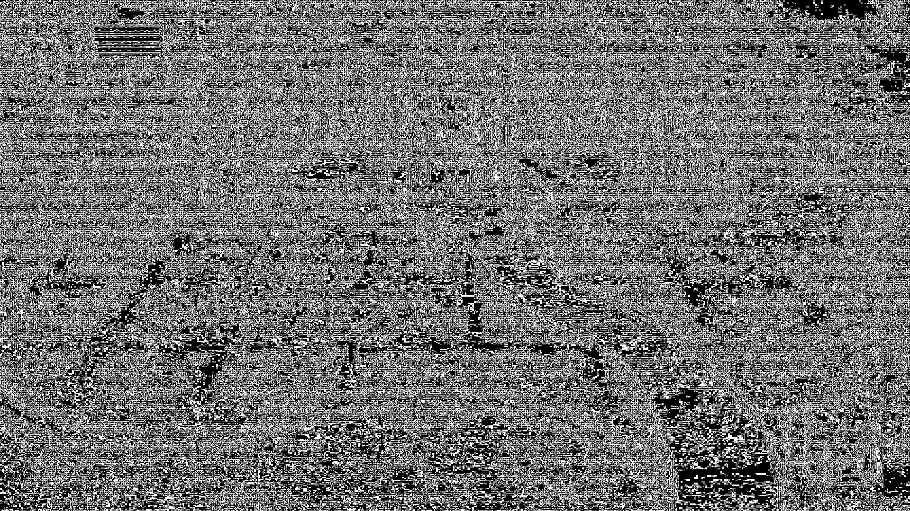
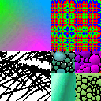

# astcenc_slang
ASTC Encoder in Slang

Now converges in ~20-40 steps for 2-partition

Caveat for 3-partition and above. The current approach is a coordinate descent to:

1. Use gradient descent on the color eps (this can be replaced by an exact PCA or lsq solver)
2. Choose the optimal partition based on distance to each color line
3. Project the ground truth pixels onto the color line to solve for the weights
4. For the last N steps, snap the ideal partition onto the set of valid ASTC partition patterns (1024)

For 2-partition, this final step works great because your hamming error rate for pixel partition mismatch is like 0.6 - 1.2 pixels per 16 pixels.
However, this jumps to like 11-12 pixels per 16 pixels for the 3-partition problem, because the valid partition space became so much smaller than the full set of valid patterns (2^10 out of 2^16 vs 2^25.5). As a result, this technique just collapses down to doing single partition search once you perform the snap.

It seems like the only way forward is to do (hard) bruteforce combinatorial search of each of the ~300 unique valid partition patterns. This will be ~50x more expensive than the current approach, going from something like 20 megapixels/s down to just 0.5 megapixels/s.

## cat.jpg

**Original**:


**Single Partition**:


```
--- Starting 1-Partition Compression ---
Running gradient descent for 40 steps

Optimization finished in 48.46 ms over 129600 threads
  Wall clock: 0.6455645561218262
Step 0: loss = 0.7794 (0.03 ms/thread mean, 0.02 ms / 0.12 ms)
Step 2: loss = 0.1151 (0.06 ms/thread mean, 0.05 ms / 0.26 ms)
Step 4: loss = 0.0373 (0.10 ms/thread mean, 0.08 ms / 0.40 ms)
Step 6: loss = 0.0201 (0.13 ms/thread mean, 0.11 ms / 0.54 ms)
Step 8: loss = 0.0152 (0.16 ms/thread mean, 0.14 ms / 0.68 ms)
Step 10: loss = 0.0133 (0.20 ms/thread mean, 0.17 ms / 0.82 ms)
Step 12: loss = 0.0123 (0.23 ms/thread mean, 0.20 ms / 0.88 ms)
Step 14: loss = 0.0117 (0.26 ms/thread mean, 0.23 ms / 0.91 ms)
Step 16: loss = 0.0112 (0.29 ms/thread mean, 0.26 ms / 0.94 ms)
Step 18: loss = 0.0109 (0.33 ms/thread mean, 0.29 ms / 0.97 ms)
Step 20: loss = 0.0106 (0.36 ms/thread mean, 0.32 ms / 1.00 ms)
Step 22: loss = 0.0104 (0.39 ms/thread mean, 0.35 ms / 1.03 ms)
Step 24: loss = 0.0102 (0.42 ms/thread mean, 0.38 ms / 1.07 ms)
Step 26: loss = 0.0100 (0.45 ms/thread mean, 0.41 ms / 1.13 ms)
Step 28: loss = 0.0098 (0.48 ms/thread mean, 0.44 ms / 1.17 ms)
Step 30: loss = 0.0097 (0.52 ms/thread mean, 0.47 ms / 1.20 ms)
Step 32: loss = 0.0096 (0.55 ms/thread mean, 0.50 ms / 1.23 ms)
Step 34: loss = 0.0095 (0.58 ms/thread mean, 0.53 ms / 1.26 ms)
Step 36: loss = 0.0093 (0.61 ms/thread mean, 0.56 ms / 1.29 ms)
Step 38: loss = 0.0092 (0.64 ms/thread mean, 0.59 ms / 1.32 ms)
 + diagnostics overhead per thread: 0.00735 ms / 0.00236 ms / 0.02276 ms
Final Mean L^2 Loss per block: 0.0092
Saved reconstructed image to 'reconstructed_1p.png'
```

**Dual Partition**:


```
--- Starting 2-Partition Compression ---
Running gradient descent for 40 steps

Optimization finished in 85.37 ms over 129600 threads
  Wall clock: 0.7166867256164551
Step 0: loss = 0.0415 (0.05 ms/thread mean, 0.03 ms / 0.20 ms)
  Partition hamming error at step 0: 161330
  Mask: 00000000000000001111111111111111
  Histogram of partitions used: [15936, 113664, 0, 0]
Step 2: loss = 0.0071 (0.11 ms/thread mean, 0.09 ms / 0.46 ms)
  Partition hamming error at step 1: 159422
  Mask: 00000000000000001111111111111111
  Histogram of partitions used: [14074, 115526, 0, 0]
Step 4: loss = 0.0038 (0.17 ms/thread mean, 0.14 ms / 0.70 ms)
  Partition hamming error at step 2: 156740
  Mask: 00000000000000001111111111111111
  Histogram of partitions used: [13964, 115636, 0, 0]
Step 6: loss = 0.0027 (0.22 ms/thread mean, 0.19 ms / 0.94 ms)
  Partition hamming error at step 3: 155796
  Mask: 00000000000000001111111111111111
  Histogram of partitions used: [13951, 115649, 0, 0]
Step 8: loss = 0.0022 (0.28 ms/thread mean, 0.24 ms / 1.11 ms)
  Partition hamming error at step 4: 155249
  Mask: 00000000000000001111111111111111
  Histogram of partitions used: [14014, 115586, 0, 0]
Step 10: loss = 0.0020 (0.33 ms/thread mean, 0.29 ms / 1.17 ms)
  Partition hamming error at step 5: 154857
  Mask: 00000000000000001111111111111111
  Histogram of partitions used: [14042, 115558, 0, 0]
Step 12: loss = 0.0019 (0.38 ms/thread mean, 0.34 ms / 1.22 ms)
  Partition hamming error at step 6: 154643
  Mask: 00000000000000001111111111111111
  Histogram of partitions used: [14121, 115479, 0, 0]
Step 14: loss = 0.0018 (0.44 ms/thread mean, 0.40 ms / 1.28 ms)
  Partition hamming error at step 7: 154747
  Mask: 00000000000000001111111111111111
  Histogram of partitions used: [14095, 115505, 0, 0]
Step 16: loss = 0.0018 (0.49 ms/thread mean, 0.45 ms / 1.34 ms)
  Partition hamming error at step 8: 154545
  Mask: 00000000000000001111111111111111
  Histogram of partitions used: [14128, 115472, 0, 0]
Step 18: loss = 0.0017 (0.55 ms/thread mean, 0.50 ms / 1.40 ms)
  Partition hamming error at step 9: 154496
  Mask: 00000000000000001111111111111111
  Histogram of partitions used: [14169, 115431, 0, 0]
Step 20: loss = 0.0017 (0.60 ms/thread mean, 0.55 ms / 1.46 ms)
  Partition hamming error at step 10: 154462
  Mask: 00000000000000001111111111111111
  Histogram of partitions used: [14107, 115493, 0, 0]
Step 22: loss = 0.0017 (0.65 ms/thread mean, 0.61 ms / 1.51 ms)
  Partition hamming error at step 11: 154383
  Mask: 00000000000000001111111111111111
  Histogram of partitions used: [14234, 115366, 0, 0]
Step 24: loss = 0.0017 (0.71 ms/thread mean, 0.66 ms / 1.57 ms)
  Partition hamming error at step 12: 154424
  Mask: 00000000000000001111111111111111
  Histogram of partitions used: [14199, 115401, 0, 0]
Step 26: loss = 0.0017 (0.76 ms/thread mean, 0.71 ms / 1.62 ms)
  Partition hamming error at step 13: 154437
  Mask: 00000000000000001111111111111111
  Histogram of partitions used: [14110, 115490, 0, 0]
Step 28: loss = 0.0017 (0.81 ms/thread mean, 0.76 ms / 1.68 ms)
  Partition hamming error at step 14: 154463
  Mask: 00000000000000001111111111111111
  Histogram of partitions used: [14126, 115474, 0, 0]
Step 30: loss = 0.0017 (0.87 ms/thread mean, 0.81 ms / 1.74 ms)
  Partition hamming error at step 15: 154461
  Mask: 00000000000000001111111111111111
  Histogram of partitions used: [14179, 115421, 0, 0]
Step 32: loss = 0.0017 (0.92 ms/thread mean, 0.86 ms / 1.79 ms)
  Partition hamming error at step 16: 154514
  Mask: 00000000000000001111111111111111
  Histogram of partitions used: [14101, 115499, 0, 0]
Step 34: loss = 0.0017 (0.97 ms/thread mean, 0.91 ms / 1.85 ms)
  Partition hamming error at step 17: 154617
  Mask: 00000000000000001111111111111111
  Histogram of partitions used: [14055, 115545, 0, 0]
Step 36: loss = 0.0017 (1.03 ms/thread mean, 0.96 ms / 1.91 ms)
  Partition hamming error at step 18: 154590
  Mask: 00000000000000001111111111111111
  Histogram of partitions used: [14055, 115545, 0, 0]
Step 38: loss = 0.0034 (1.12 ms/thread mean, 1.04 ms / 1.99 ms)
  Partition hamming error at step 19: 0
  Mask: 00000000000000001111111111111111
  Histogram of partitions used: [13935, 115665, 0, 0]
 + diagnostics overhead per thread: 0.00584 ms / 0.00352 ms / 0.05568 ms
Partition hamming error: 0.07543981481481482
Final Mean L^2 Loss per block: 0.0030
```

**3 Partitions, no-snapping, just partition pattern**:



```
--- Starting 3-Partition Compression ---
Running gradient descent for 40 steps

Optimization finished in 651.75 ms over 129600 threads
  Wall clock: 1.2950479984283447
Step 0: loss = 0.0350 (0.10 ms/thread mean, 0.07 ms / 0.24 ms)
  Partition hamming error at step 0: 336538
  Mask: 10101010101010101010101010101010
  Histogram of partitions used: [28542, 15646, 85412, 0]
Step 2: loss = 0.0067 (0.27 ms/thread mean, 0.22 ms / 0.76 ms)
  Partition hamming error at step 1: 394799
  Mask: 10101010101010101010101010101010
  Histogram of partitions used: [10685, 20724, 98191, 0]
Step 4: loss = 0.0033 (0.39 ms/thread mean, 0.31 ms / 0.89 ms)
  Partition hamming error at step 2: 395413
  Mask: 10101010101010101010101010101010
  Histogram of partitions used: [10041, 20940, 98619, 0]
Step 6: loss = 0.0020 (0.52 ms/thread mean, 0.40 ms / 1.01 ms)
  Partition hamming error at step 3: 395496
  Mask: 10101010101010101010101010101010
  Histogram of partitions used: [9957, 20914, 98729, 0]
Step 8: loss = 0.0015 (0.64 ms/thread mean, 0.49 ms / 1.13 ms)
  Partition hamming error at step 4: 395251
  Mask: 10101010101010101010101010101010
  Histogram of partitions used: [10115, 20779, 98706, 0]
Step 10: loss = 0.0012 (0.77 ms/thread mean, 0.58 ms / 1.25 ms)
  Partition hamming error at step 5: 395264
  Mask: 10101010101010101010101010101010
  Histogram of partitions used: [10202, 20700, 98698, 0]
Step 12: loss = 0.0011 (0.89 ms/thread mean, 0.67 ms / 1.37 ms)
  Partition hamming error at step 6: 395522
  Mask: 10101010101010101010101010101010
  Histogram of partitions used: [10177, 20638, 98785, 0]
Step 14: loss = 0.0010 (1.02 ms/thread mean, 0.76 ms / 1.48 ms)
  Partition hamming error at step 7: 395340
  Mask: 10101010101010101010101010101010
  Histogram of partitions used: [10273, 20639, 98688, 0]
Step 16: loss = 0.0010 (1.14 ms/thread mean, 0.85 ms / 1.60 ms)
  Partition hamming error at step 8: 395611
  Mask: 10101010101010101010101010101010
  Histogram of partitions used: [10266, 20639, 98695, 0]
Step 18: loss = 0.0010 (1.27 ms/thread mean, 0.94 ms / 1.72 ms)
  Partition hamming error at step 9: 395221
  Mask: 10101010101010101010101010101010
  Histogram of partitions used: [10329, 20646, 98625, 0]
Step 20: loss = 0.0009 (1.39 ms/thread mean, 1.03 ms / 1.84 ms)
  Partition hamming error at step 10: 395141
  Mask: 10101010101010101010101010101010
  Histogram of partitions used: [10383, 20611, 98606, 0]
Step 22: loss = 0.0009 (1.52 ms/thread mean, 1.12 ms / 1.96 ms)
  Partition hamming error at step 11: 395075
  Mask: 10101010101010101010101010101010
  Histogram of partitions used: [10405, 20602, 98593, 0]
Step 24: loss = 0.0009 (1.64 ms/thread mean, 1.21 ms / 2.08 ms)
  Partition hamming error at step 12: 394953
  Mask: 10101010101010101010101010101010
  Histogram of partitions used: [10351, 20749, 98500, 0]
Step 26: loss = 0.0009 (1.76 ms/thread mean, 1.30 ms / 2.20 ms)
  Partition hamming error at step 13: 394950
  Mask: 10101010101010101010101010101010
  Histogram of partitions used: [10350, 20700, 98550, 0]
Step 28: loss = 0.0009 (1.89 ms/thread mean, 1.39 ms / 2.32 ms)
  Partition hamming error at step 14: 394937
  Mask: 10101010101010101010101010101010
  Histogram of partitions used: [10360, 20701, 98539, 0]
Step 30: loss = 0.0057 (3.19 ms/thread mean, 2.65 ms / 3.65 ms)
  Partition hamming error at step 15: 0
  Mask: 10101010101010101010101010101010
  Histogram of partitions used: [10721, 53326, 65553, 0]
Step 32: loss = 0.0036 (4.45 ms/thread mean, 3.85 ms / 4.93 ms)
  Partition hamming error at step 16: 0
  Mask: 10101010101010101010101010101010
  Histogram of partitions used: [10539, 53367, 65694, 0]
Step 34: loss = 0.0029 (5.71 ms/thread mean, 5.05 ms / 6.18 ms)
  Partition hamming error at step 17: 0
  Mask: 10101010101010101010101010101010
  Histogram of partitions used: [10383, 53486, 65731, 0]
Step 36: loss = 0.0026 (6.97 ms/thread mean, 6.25 ms / 7.43 ms)
  Partition hamming error at step 18: 0
  Mask: 10101010101010101010101010101010
  Histogram of partitions used: [10237, 53575, 65788, 0]
Step 38: loss = 0.0024 (8.23 ms/thread mean, 7.45 ms / 8.68 ms)
  Partition hamming error at step 19: 0
  Mask: 10101010101010101010101010101010
  Histogram of partitions used: [10058, 53771, 65771, 0]
 + diagnostics overhead per thread: 0.02576 ms / 0.01108 ms / 0.04452 ms
Partition hamming error: 0.0
Final Mean L^2 Loss per block: 0.0024
```

## test_rgb_hard.png

**Original**:


**Single Partition**:


```
--- Starting 1-Partition Compression ---
Running gradient descent for 40 steps

Optimization finished in 0.83 ms over 1024 threads
  Wall clock: 0.13380885124206543
Step 0: loss = 4.0983 (0.11 ms/thread mean, 0.11 ms / 0.11 ms)
Step 2: loss = 0.5616 (0.25 ms/thread mean, 0.25 ms / 0.25 ms)
Step 4: loss = 0.4537 (0.29 ms/thread mean, 0.29 ms / 0.29 ms)
Step 6: loss = 0.4304 (0.32 ms/thread mean, 0.32 ms / 0.32 ms)
Step 8: loss = 0.4225 (0.35 ms/thread mean, 0.35 ms / 0.35 ms)
Step 10: loss = 0.4205 (0.38 ms/thread mean, 0.38 ms / 0.38 ms)
Step 12: loss = 0.4198 (0.41 ms/thread mean, 0.41 ms / 0.41 ms)
Step 14: loss = 0.4198 (0.44 ms/thread mean, 0.44 ms / 0.44 ms)
Step 16: loss = 0.4199 (0.47 ms/thread mean, 0.47 ms / 0.47 ms)
Step 18: loss = 0.4199 (0.50 ms/thread mean, 0.50 ms / 0.50 ms)
Step 20: loss = 0.4202 (0.53 ms/thread mean, 0.53 ms / 0.53 ms)
Step 22: loss = 0.4206 (0.56 ms/thread mean, 0.56 ms / 0.56 ms)
Step 24: loss = 0.4209 (0.59 ms/thread mean, 0.59 ms / 0.59 ms)
Step 26: loss = 0.4211 (0.62 ms/thread mean, 0.62 ms / 0.62 ms)
Step 28: loss = 0.4213 (0.65 ms/thread mean, 0.65 ms / 0.65 ms)
Step 30: loss = 0.4215 (0.68 ms/thread mean, 0.68 ms / 0.69 ms)
Step 32: loss = 0.4217 (0.71 ms/thread mean, 0.71 ms / 0.72 ms)
Step 34: loss = 0.4218 (0.74 ms/thread mean, 0.74 ms / 0.75 ms)
Step 36: loss = 0.4219 (0.77 ms/thread mean, 0.77 ms / 0.78 ms)
Step 38: loss = 0.4219 (0.80 ms/thread mean, 0.80 ms / 0.81 ms)
 + diagnostics overhead per thread: 0.00678 ms / 0.00444 ms / 0.00796 ms
Final Mean L^2 Loss per block: 0.4216
```

**Dual Partition**:


```
--- Starting 2-Partition Compression ---
Running gradient descent for 40 steps

Optimization finished in 1.83 ms over 1024 threads
  Wall clock: 0.17380666732788086
Step 0: loss = 1.7100 (0.18 ms/thread mean, 0.18 ms / 0.18 ms)
  Partition hamming error at step 0: 687
  Mask: 00000000000000001011110011001100
  Histogram of partitions used: [311, 713, 0, 0]
Step 2: loss = 0.1746 (0.43 ms/thread mean, 0.42 ms / 0.43 ms)
  Partition hamming error at step 1: 730
  Mask: 00000000000000001011010111011100
  Histogram of partitions used: [299, 725, 0, 0]
Step 4: loss = 0.0814 (0.66 ms/thread mean, 0.65 ms / 0.66 ms)
  Partition hamming error at step 2: 726
  Mask: 00000000000000001011010111011000
  Histogram of partitions used: [296, 728, 0, 0]
Step 6: loss = 0.0443 (0.86 ms/thread mean, 0.86 ms / 0.86 ms)
  Partition hamming error at step 3: 730
  Mask: 00000000000000001010010100011000
  Histogram of partitions used: [294, 730, 0, 0]
Step 8: loss = 0.0275 (0.91 ms/thread mean, 0.91 ms / 0.91 ms)
  Partition hamming error at step 4: 723
  Mask: 00000000000000001010010100010000
  Histogram of partitions used: [294, 730, 0, 0]
Step 10: loss = 0.0197 (0.96 ms/thread mean, 0.96 ms / 0.97 ms)
  Partition hamming error at step 5: 722
  Mask: 00000000000000001010010100010000
  Histogram of partitions used: [293, 731, 0, 0]
Step 12: loss = 0.0159 (1.01 ms/thread mean, 1.01 ms / 1.02 ms)
  Partition hamming error at step 6: 724
  Mask: 00000000000000001010010100010000
  Histogram of partitions used: [293, 731, 0, 0]
Step 14: loss = 0.0142 (1.06 ms/thread mean, 1.06 ms / 1.07 ms)
  Partition hamming error at step 7: 725
  Mask: 00000000000000001010000100010000
  Histogram of partitions used: [293, 731, 0, 0]
Step 16: loss = 0.0133 (1.12 ms/thread mean, 1.11 ms / 1.12 ms)
  Partition hamming error at step 8: 725
  Mask: 00000000000000001010000100000000
  Histogram of partitions used: [294, 730, 0, 0]
Step 18: loss = 0.0129 (1.17 ms/thread mean, 1.16 ms / 1.18 ms)
  Partition hamming error at step 9: 725
  Mask: 00000000000000001010000000000000
  Histogram of partitions used: [294, 730, 0, 0]
Step 20: loss = 0.0129 (1.22 ms/thread mean, 1.21 ms / 1.23 ms)
  Partition hamming error at step 10: 726
  Mask: 00000000000000001010000000000000
  Histogram of partitions used: [295, 729, 0, 0]
Step 22: loss = 0.0128 (1.27 ms/thread mean, 1.26 ms / 1.28 ms)
  Partition hamming error at step 11: 727
  Mask: 00000000000000001010000000000000
  Histogram of partitions used: [293, 731, 0, 0]
Step 24: loss = 0.0127 (1.32 ms/thread mean, 1.31 ms / 1.33 ms)
  Partition hamming error at step 12: 727
  Mask: 00000000000000001010000000000000
  Histogram of partitions used: [294, 730, 0, 0]
Step 26: loss = 0.0127 (1.37 ms/thread mean, 1.36 ms / 1.38 ms)
  Partition hamming error at step 13: 726
  Mask: 00000000000000001010000000000000
  Histogram of partitions used: [294, 730, 0, 0]
Step 28: loss = 0.0127 (1.42 ms/thread mean, 1.41 ms / 1.44 ms)
  Partition hamming error at step 14: 723
  Mask: 00000000000000001010000000000000
  Histogram of partitions used: [294, 730, 0, 0]
Step 30: loss = 0.0127 (1.47 ms/thread mean, 1.46 ms / 1.49 ms)
  Partition hamming error at step 15: 723
  Mask: 00000000000000001010000000000000
  Histogram of partitions used: [294, 730, 0, 0]
Step 32: loss = 0.0127 (1.53 ms/thread mean, 1.52 ms / 1.55 ms)
  Partition hamming error at step 16: 725
  Mask: 00000000000000001010000000000000
  Histogram of partitions used: [294, 730, 0, 0]
Step 34: loss = 0.0127 (1.60 ms/thread mean, 1.58 ms / 1.62 ms)
  Partition hamming error at step 17: 725
  Mask: 00000000000000001010000000000000
  Histogram of partitions used: [294, 730, 0, 0]
Step 36: loss = 0.0127 (1.66 ms/thread mean, 1.65 ms / 1.68 ms)
  Partition hamming error at step 18: 726
  Mask: 00000000000000001010000000000000
  Histogram of partitions used: [294, 730, 0, 0]
Step 38: loss = 0.2047 (1.75 ms/thread mean, 1.74 ms / 1.78 ms)
  Partition hamming error at step 19: 0
  Mask: 00000000000000001110000000000000
  Histogram of partitions used: [393, 631, 0, 0]
 + diagnostics overhead per thread: 0.00505 ms / 0.00444 ms / 0.00752 ms
Partition hamming error: 0.03125
Final Mean L^2 Loss per block: 0.1908
```

**3 Partitions, no-snapping, just partition pattern**:



```
--- Starting 3-Partition Compression ---
Running gradient descent for 40 steps

Optimization finished in 8.83 ms over 1024 threads
  Wall clock: 0.18939805030822754
Step 0: loss = 4.0960 (0.22 ms/thread mean, 0.22 ms / 0.22 ms)
  Partition hamming error at step 0: 1523
  Mask: 10000000000100000010010000100100
  Histogram of partitions used: [445, 284, 295, 0]
Step 2: loss = 0.1652 (0.72 ms/thread mean, 0.72 ms / 0.73 ms)
  Partition hamming error at step 1: 2320
  Mask: 10000000000100000000010000100101
  Histogram of partitions used: [271, 229, 524, 0]
Step 4: loss = 0.0689 (1.07 ms/thread mean, 1.07 ms / 1.08 ms)
  Partition hamming error at step 2: 2328
  Mask: 10000000000100000000010000100101
  Histogram of partitions used: [274, 224, 526, 0]
Step 6: loss = 0.0325 (1.16 ms/thread mean, 1.16 ms / 1.17 ms)
  Partition hamming error at step 3: 2330
  Mask: 10000000000100000000010000100101
  Histogram of partitions used: [273, 226, 525, 0]
Step 8: loss = 0.0163 (1.25 ms/thread mean, 1.25 ms / 1.26 ms)
  Partition hamming error at step 4: 2322
  Mask: 10000000000100000000010000100101
  Histogram of partitions used: [272, 227, 525, 0]
Step 10: loss = 0.0089 (1.34 ms/thread mean, 1.34 ms / 1.35 ms)
  Partition hamming error at step 5: 2320
  Mask: 10000000000100000000010000100101
  Histogram of partitions used: [272, 227, 525, 0]
Step 12: loss = 0.0055 (1.43 ms/thread mean, 1.43 ms / 1.44 ms)
  Partition hamming error at step 6: 2325
  Mask: 10000000000100000000010000100101
  Histogram of partitions used: [271, 227, 526, 0]
Step 14: loss = 0.0040 (1.52 ms/thread mean, 1.52 ms / 1.53 ms)
  Partition hamming error at step 7: 2333
  Mask: 10000000000100000000010000100101
  Histogram of partitions used: [273, 223, 528, 0]
Step 16: loss = 0.0034 (1.61 ms/thread mean, 1.61 ms / 1.62 ms)
  Partition hamming error at step 8: 2325
  Mask: 10000000000100000000010000100101
  Histogram of partitions used: [273, 224, 527, 0]
Step 18: loss = 0.0031 (1.70 ms/thread mean, 1.70 ms / 1.71 ms)
  Partition hamming error at step 9: 2326
  Mask: 10000000000100000000010000100101
  Histogram of partitions used: [273, 225, 526, 0]
Step 20: loss = 0.0029 (1.79 ms/thread mean, 1.79 ms / 1.80 ms)
  Partition hamming error at step 10: 2327
  Mask: 10000000000100000000010000100101
  Histogram of partitions used: [274, 224, 526, 0]
Step 22: loss = 0.0029 (1.88 ms/thread mean, 1.88 ms / 1.89 ms)
  Partition hamming error at step 11: 2329
  Mask: 10000000000100000000010000100101
  Histogram of partitions used: [272, 226, 526, 0]
Step 24: loss = 0.0029 (1.97 ms/thread mean, 1.97 ms / 1.98 ms)
  Partition hamming error at step 12: 2326
  Mask: 10000000000100000000010000100101
  Histogram of partitions used: [272, 227, 525, 0]
Step 26: loss = 0.0029 (2.06 ms/thread mean, 2.05 ms / 2.07 ms)
  Partition hamming error at step 13: 2326
  Mask: 10000000000100000000010000100101
  Histogram of partitions used: [272, 227, 525, 0]
Step 28: loss = 0.0029 (2.15 ms/thread mean, 2.14 ms / 2.16 ms)
  Partition hamming error at step 14: 2331
  Mask: 10000000000100000000010000100101
  Histogram of partitions used: [272, 226, 526, 0]
Step 30: loss = 0.4876 (3.39 ms/thread mean, 3.39 ms / 3.39 ms)
  Partition hamming error at step 15: 0
  Mask: 00000000000000000000000000010101
  Histogram of partitions used: [300, 415, 309, 0]
Step 32: loss = 0.3860 (4.58 ms/thread mean, 4.57 ms / 4.60 ms)
  Partition hamming error at step 16: 0
  Mask: 00000000000000000000000000010101
  Histogram of partitions used: [304, 405, 315, 0]
Step 34: loss = 0.3473 (5.77 ms/thread mean, 5.76 ms / 5.80 ms)
  Partition hamming error at step 17: 0
  Mask: 00000000000000000000000000010101
  Histogram of partitions used: [302, 409, 313, 0]
Step 36: loss = 0.3178 (6.97 ms/thread mean, 6.94 ms / 7.00 ms)
  Partition hamming error at step 18: 0
  Mask: 00000000000000000000000000010101
  Histogram of partitions used: [301, 409, 314, 0]
Step 38: loss = 0.3032 (8.16 ms/thread mean, 8.13 ms / 8.20 ms)
  Partition hamming error at step 19: 0
  Mask: 00000000000000000000000000010101
  Histogram of partitions used: [301, 409, 314, 0]
 + diagnostics overhead per thread: 0.01047 ms / 0.00824 ms / 0.01172 ms
Partition hamming error: 0.0
Final Mean L^2 Loss per block: 0.2993
```

## Ideas:

1. Full soft decoder with autodiff (done - slow convergence)
2. [2P] Coordinate descent with gradient descent on partition logits (done - poor stability)
3. [2P] Coordinate descent with gradient descent on the color eps (done - good results, ~but trapped in local minimums~)
4. Extend to 3P and 4P depending on # of distinct colors, using a combinatorial search of partition seeds
5. ~Use RANSAC to select partitions, using the inlier count as a statistic to uncover # of distinct color lines~
    * Turns out partition selection isn't the problem, it's astc snapping, and jointly modeling the optimization with that in mind
      is very hard without resorting to combinatorial search
6. Actually implement the bise encoding and the astc block format